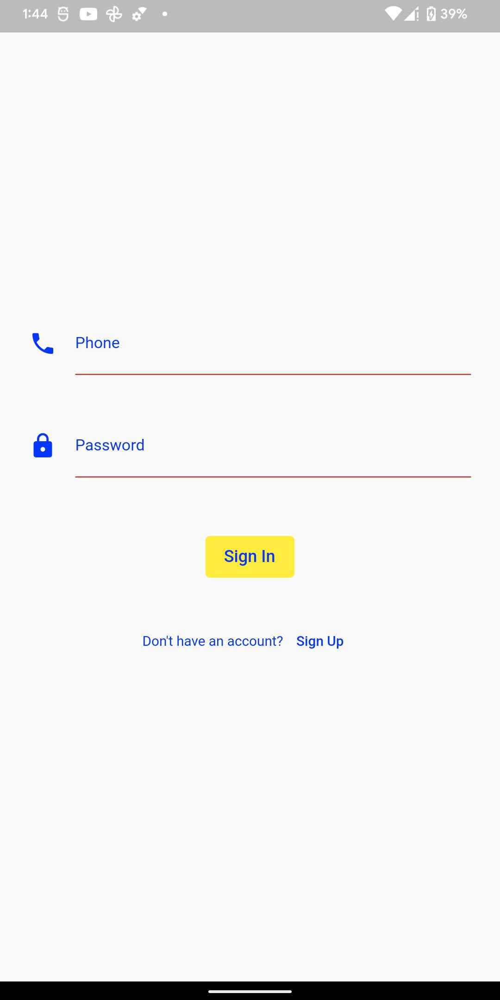
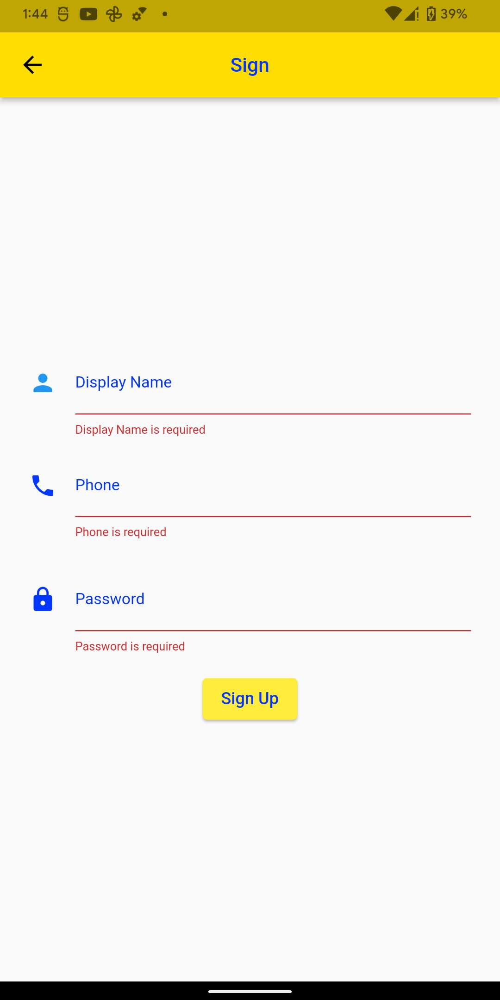

# **Book Story**

## Giới thiệu
App sử dụng api của code4func cung cấp được viết bằng golang, hiện tại app chỉ đọc qua api và hiển thị ra màn hình, chưa có tính năng tải về, đọc offline.
- [Video demo](https://www.youtube.com)

## Nội dung
- [Đặc trưng](#Đặc-trưng)
- [Thiết lập](#Thiết-lập)
- [Màn hình](#Màn-hình)
- [Thư viện và Công nghệ](#Thư-viện-và-Công-nghệ)


## Đặc trưng
- Danh sách truyện
    * Xem nội dung truyện
    * Xem tiêu đề truyện
    * Xem tên tác giả
    * Xem tên thể loại
    * Xem tên tình trạng
    * Xem giá
- Giỏ hàng
    * Xem nội dung truyện
    * Xem tiêu đề truyện
    * Xem tên tác giả
    * Xem tên thể loại
    * Xem tên tình trạng
    * Xem giá
    * Xem tổng tiền
    * Xem số lượng truyện
    * Xóa truyện khỏi giỏ hàng
    * Thanh toán
- Đăng nhập
    * Đăng nhập bằng tài khoản đăng ký
- Đăng Ký
    * Đăng ký tài khoản mới bằng số điện thoại
    * Mật khẩu ít nhất 6 ký tự
## Thiết lập
- Cài đặt golang
- Cài đặt mysql
- clone repository
  ```
    $ git clone https://github.com/HiemIT/backend_bookstore.git
  ```
  - Chạy file main.go bằng cách vào folder cmd và chạy lệnh
  ```
  $ go run main.go
  ```
  - clone project book app
  ```
  $ git clone https://github.com/HiemIT/flutter_app_book_store.git
  ```
    - Chạy project bằng cách vào folder book_app và chạy lệnh
  ```
  $ flutter pub get
  ```
  ```
  $ flutter run 
  ```
  
## Màn hình
- [Danh sách truyện](#Danh-sách-truyện)
- [Giỏ hàng](#Giỏ-hàng)
- [Đăng nhập](#Đăng-nhập)
- [Đăng ký](#Đăng-ký)

### **Danh sách truyện**
</a>

### **Giỏ hàng**
</a>

### **Đăng nhập**
</a>

### **Đăng ký**
</a>


## **Thư viện và Công nghệ**

* [Golang](https://golang.org/)
* [Flutter](https://flutter.dev/)
* [Pub.dev](https://pub.dev/)
* [Mysql](https://www.mysql.com/)
* [Postman](https://www.postman.com/)
* [Provider](https://pub.dev/packages/provider)
* [Dio](https://pub.dev/packages/dio)
* [Rxdart](https://pub.dev/packages/rxdart)